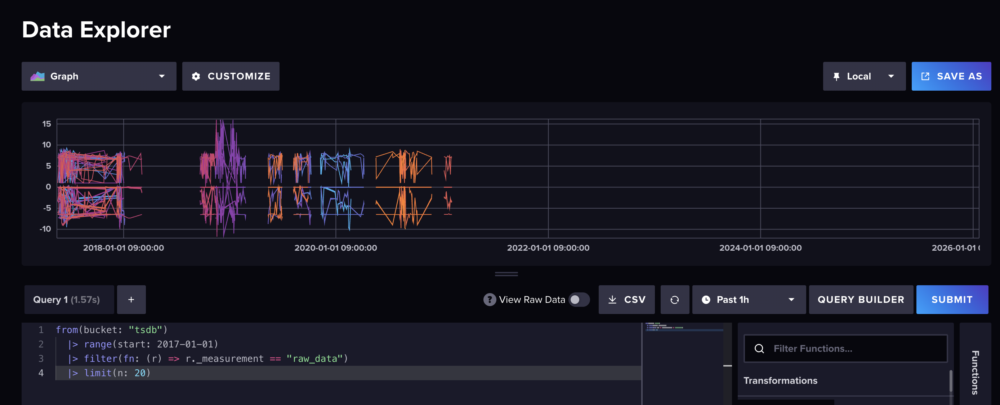
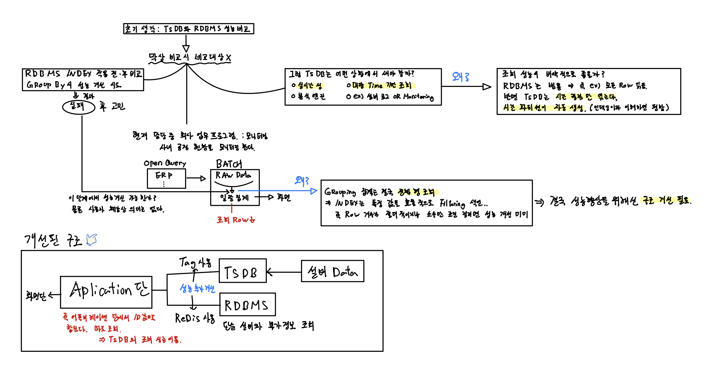
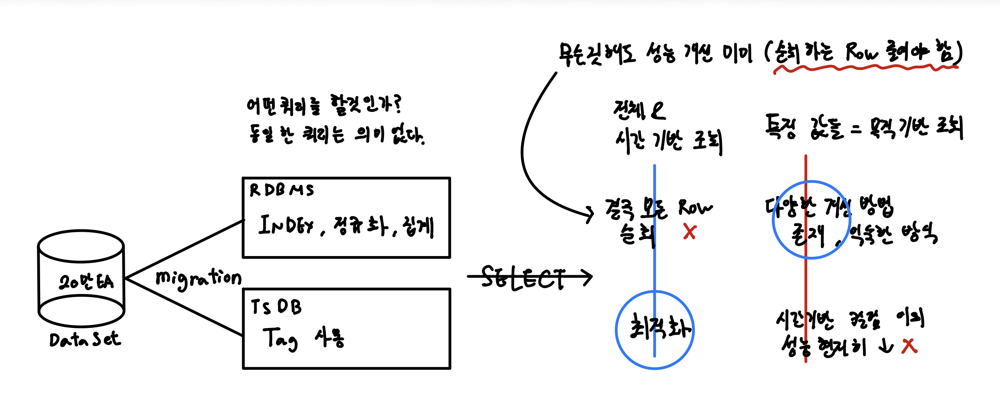

<h1 align="left">Time-Series-Lab: 시계열 DB</h1>

> RDBMS와 TSDB 성능 비교 시도에서, 구조와 환경에 맞는 기술 선택으로의 정리

**수행기간**: 2026. 01. 04 - 2026. 02. 08 (5주)  
**수행배경**: 최근 AI 흐름에 맞춰 시계열 DB 환경을 구축하고 기존 RDBMS와의 성능을 비교하기 위함

---

influxdb 데이터 마이그레이션 하여 적재 후 모니터링 진행

## 0. 정리 및 필기

쿼리 튜닝, 성능 비교 진행하면서 생각 정리 얻은것들 로드맵 정리
(개인 학습을 위한 목적이 크기 때문에 성능 비교를 하나씩 캡쳐까지 하진 않았다.)

## 1. 프로젝트 목적

이 저장소는 시계열 데이터 환경에서 RDBMS와 TSDB를 직접 다뤄보며,
단순한 성능 비교가 아닌 데이터 특성과 시스템 구조에 따른 기술 선택 기준을 정리하기 위한 학습

초기 목적은 다음과 같았다.
	•	대용량 시계열 데이터를 기준으로
RDBMS와 TSDB의 조회 성능 차이를 비교
	•	다양한 인덱스, GROUP BY, 시간 조건 쿼리를 통해
실제 성능 차이를 확인

## 2. 초기 가설과 접근

초기에는 다음과 같은 가설을 세움

“적절한 인덱싱과 쿼리 튜닝을 하면
RDBMS에서도 TSDB와 유사한 성능을 낼 수 있지 않을까?”

이를 검증하기 위해:
	•	RDBMS
	•	날짜 컬럼 인덱스 적용
	•	GROUP BY 기반 집계 쿼리
	•	조건 필터링 최적화 시도
	•	TSDB
	•	동일 데이터를 시계열 구조로 적재
	•	시간 범위 기반 조회 및 집계

## 3. 문제 인식: 성능 비교 자체의 한계

실험을 진행하면서 다음과 같은 결론에 도달했다.

❗ 동일한 기준에서의 성능 비교는 의미가 없다
	•	RDBMS와 TSDB는 출발점부터 다른 목적을 가진 기술
	•	저장 구조, 조회 방식, 최적화 전략이 근본적으로 다름

즉,

“어느 쪽이 더 빠른가”를 비교하는 질문 자체가 잘못된 접근이었다.

## 4. 기술적 관찰과 정리

1️⃣ RDBMS 인덱스의 한계
	•	인덱스는 소수 Row를 빠르게 필터링할 때 가장 효과적
	•	시계열 데이터 특성상:
	•	특정 기간 범위 조회
	•	대량 Row 대상 집계가 잦음
	•	결국 대부분의 Row를 스캔하게 되어
GROUP BY 중심 쿼리에서는 인덱스 효과가 제한적

2️⃣ TSDB의 성능은 “쿼리”보다 “구조”에서 나온다
	•	시간 기준 파티셔닝
	•	자동 압축
	•	Time-range 쿼리를 전제로 한 저장 방식

TSDB의 조회 성능은 튜닝 결과가 아니라,
설계 단계에서 이미 결정된 구조적 특성이다.

3️⃣ 성능 문제는 DB 선택의 문제가 아니라 구조의 문제
	•	RDBMS를 무리하게 튜닝하는 것보다
	•	데이터 성격에 맞는 저장소를 선택하는 것이 더 합리적

## 5. 관점 전환: “성능 비교” → “환경에 맞는 기술 선택”

이 프로젝트의 핵심 결론은 다음과 같다.

DB 성능은 단일 수치로 비교할 대상이 아니라,
데이터 성격과 사용 목적에 따라 달라지는 선택의 문제다.

	•	시계열 데이터 → TSDB
	•	기준 정보, 메타 데이터, 비즈니스 데이터 → RDBMS
	•	실시간 조회 응답 → 캐시(Redis)

## 6. 개선된 구조 개념

단일 DB에 모든 역할을 맡기기보다,
역할 분리 기반의 구조가 더 현실적이라는 결론에 도달했다.

### TSDB
	•	설비 및 시계열 Raw 데이터 저장
	•	시간 범위 조회 및 집계
### RDBMS
	•	설비 정보
	•	기준 데이터
	•	관리/비즈니스 데이터
### Redis
	•	조회 결과 캐싱
	•	대시보드 응답 성능 개선
	•	Application Layer
	•	필요한 데이터만 조합
	•	화면 단에서는 DB 종류를 의식하지 않도록 설계

## 7. 한 줄 요약

RDBMS와 TSDB의 성능을 비교하려다,
성능보다 중요한 것은 데이터 특성과 시스템 구조에 맞는 기술 선택이라는 점을 정리한 프로젝트
